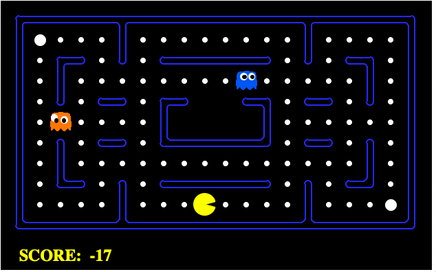

# Pac-Man AI Project

Based on the the Pac-Man project from Berkley's intro to AI.

Learn to develop basic search algorithms to help improve my understanding of search algorithms include: breath first search, depth first search, and A star algorithm

[Click this link for more info](http://ai.berkeley.edu/project_overview.html)